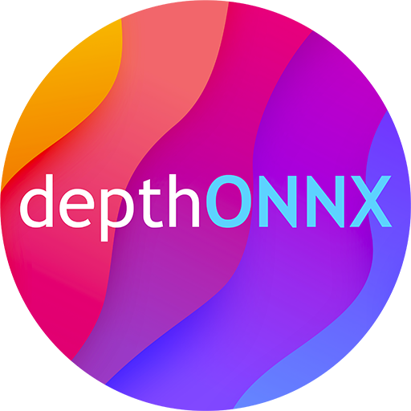

<p align="center"></p>
<p align="center"> Monocular depth estimation library based on deep neural networks and <b>ONNX</b> runtime </p>  

# DepthONNX
**DepthONNX** is a monocular depth estimation library based on deep neural networks and [ONNX](https://onnx.ai/) runtime.

# Version
You can build **DepthONNX** from sources or install to your own project using nuget package manager.
| Assembly | Specification | OS | Package | Algebra |
|-------------|:-------------:|:-------------:|:--------------:|:--------------:|
| [DepthONNX](netstandard/DepthONNX) | .NET Standard 2.0 | Cross-platform | [NuGet](https://www.nuget.org/packages/DepthONNX/) | [UMapx](https://github.com/asiryan/UMapx) |

# Installation
C# interface  
```c#
using DepthONNX;
```
To get started with **DepthONNX**, it is recommended to look at the folder with [examples](netstandard/Examples).  

# License
**DepthONNX** is released under the [MIT](LICENSE) license.
